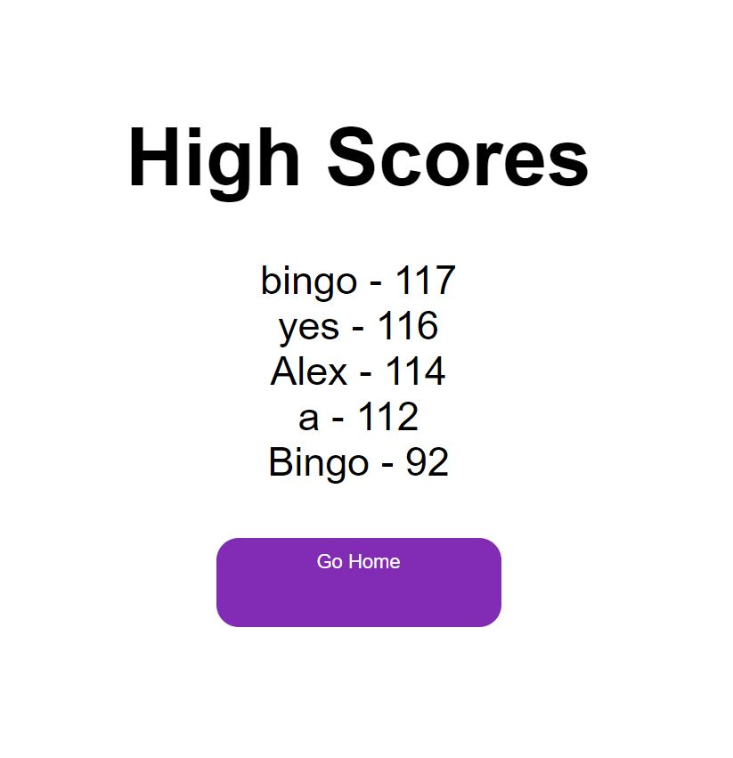

**JS Quiz**

**Description**

The aim of this project is a Javascript quiz, made primarily of manipulated DOM's. The entire project is compromised as below:

2 CSS files
3 JS Files
3 HTML files

To launch the Quiz, simple navigate to https://awchen85.github.io/quiz/ and click Start Quiz.

Answer the questions as they come. A correct answer adds time to your score, incorrect reduces it.

At the end, input your username and see how your score ranked!

